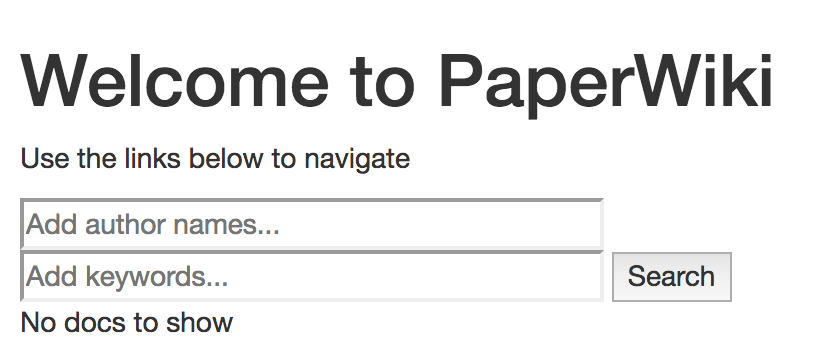
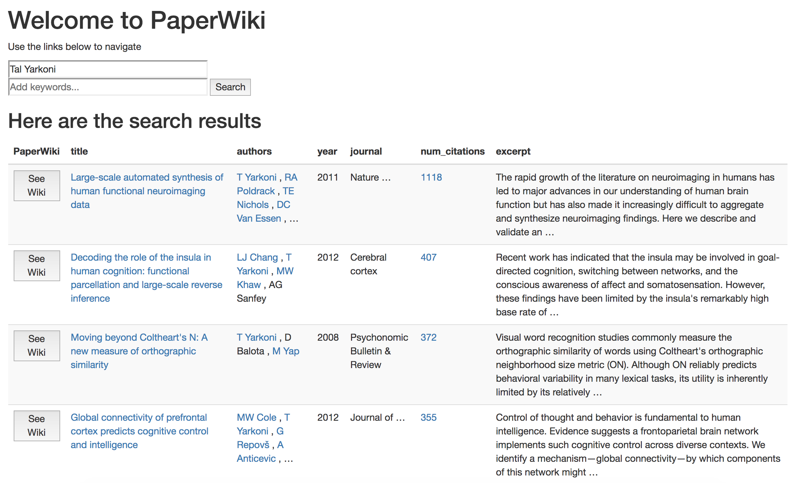
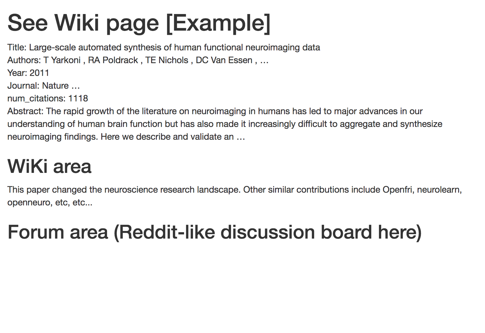

# paperwiki


Paperwiki is a platform to foster open discussions about academic papers.

Architecture:
Uses google scholar to search for articles (use scholar.py)
"Create Page" will generate a DB for an article
that would be saved into mongodb.
A page will have the following format.
Title.
Authors & Affiliations.
Year. Journal. Page. Etc.

Abstract

Paperwiki section
[People can enter information about the article]


# Features
- search google scholar
- create or see wiki pages on each paper
- each wiki page will also host a reddit-like forum for discussions
- main page will have a feed for recent wiki updates
- users who contribute to the wiki will be notified when changed
- users can star (bookmark) papers to their paperwiki library.
- network map of literature.
- retraction watch buttons and such.

# To run:
1. install dependencies
2. update username and password in `config.py` file
3. run
```
python app.py
```
in browser navigate to localhost:5000

# To deploy
1. https://medium.com/the-andela-way/deploying-a-python-flask-app-to-heroku-41250bda27d0
2. Set environ variable for port.
Config Vars: ON_HEROKU : True

Basically,
1. Navigate to `paperwiki_deploy`
2. `cd paperwiki`
3. `git pull`
4. Push to heroku
```
$ git add .
$ git commit -am "make it better"
$ git push heroku master
```


# Resources
https://github.com/reddit-archive/reddit  
https://github.com/ckreibich/scholar.py  
https://flaskbb.readthedocs.io/en/latest/installation.html  
https://github.com/fabiobatalha/crossrefapi  




